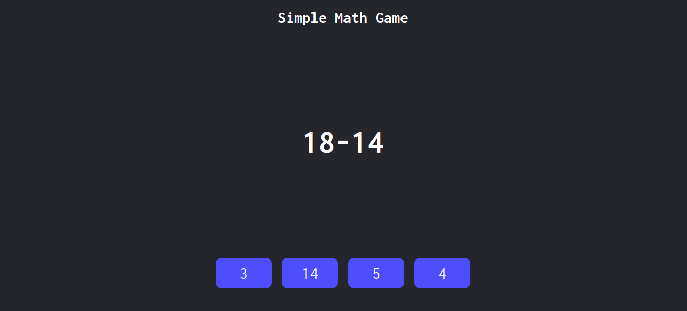

# Simple Math Game

Simple Math Game is simple math game built with HTML, CSS, and Javascript.

Suitable for newbie who started to learn Javascript. Learn about DOM Manipulation, array function, and so much more!

## How It Works?
- First, it will run generateQuestions() function to generate math question from random numbers in certain range and render the options. 
- If you choose one of the options, it will validate with validateAnswer() function. If you choose the correct one, then it will run correctAnswer() and change your options background color to green. If you choose the wrong one, it will run wrongAnswer() and your options background color will be pink.
- After you choose the answer, it will generate the next question for you. 