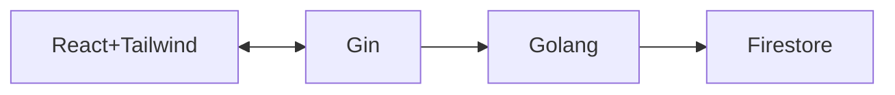

# React-Go-App

## Simple CRUD Application

A little description here.

## Flow Chart

Here is a simple flow chart:

<!---
flowchart LR;
graph TD;

# Folder Structure

> Folder structure options and naming conventions for software projects

### A typical top-level directory layout

    ├── Models/ Entry.go
    ├── Routes
    │   ├── Connection.go
    │   └── Entries.go
    ├── docs                    # Documentation files (alternatively `doc`)
    ├── src                     # Source files (alternatively `lib` or `app`)
    ├── test                    # Automated tests (alternatively `spec` or `tests`)
    ├── tools                   # Tools and utilities
    ├── LICENSE
    └── README.md

-->

