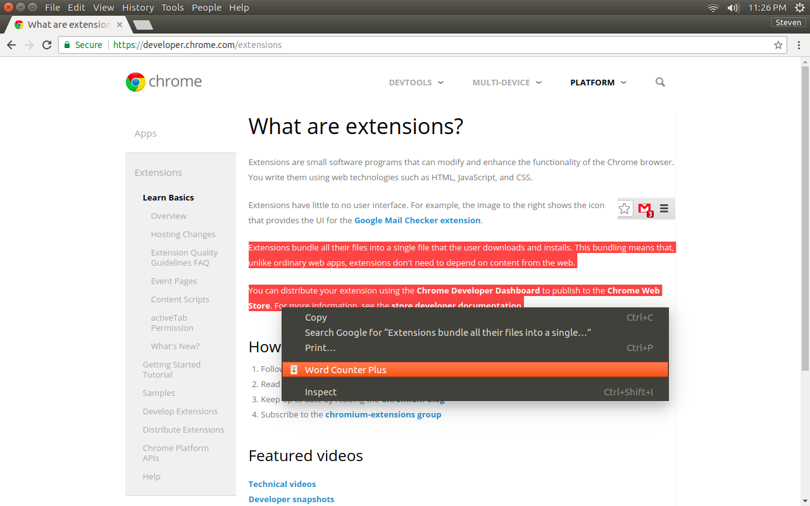
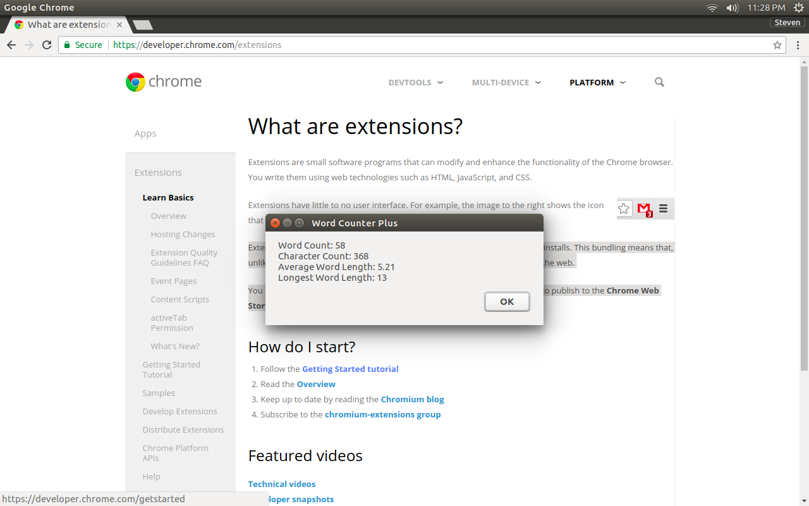

# Word Counter Plus

Word Counter Plus is a simple and useful tool that lets you views stats on
selected text. Simply highlight some text on a webpage, right click on it, and
select the Word Counter Plus menu item. It will tell you the number of words and
characters selected as well as the average and longest word length. Unlike
similar word counting extensions, this one does not open an external webpage
just to do the counting, nor does it require any permissions.

You can install this Chrome Extension [here](https://chrome.google.com/webstore/detail/fpjegfbcdijjfkceenlfoehpcakfgldj).

## Screenshots

